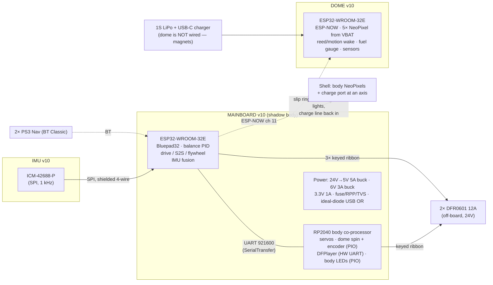
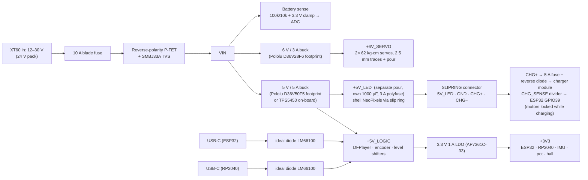

# Z-Class v10.0 — Board Redesign

**Scope:** Mainboard ("shadow body" v9.15 → v10.0), IMU board (v8.2 → v10.0), Dome board (v8.2 → v10.0)
**Inputs:** full netlist reconstruction of the v9.15 / v8.2 Gerbers (`PCB_ANALYSIS.md`), the RC4 firmware work, and two bench sessions
**Status:** design specification for schematic capture — not yet laid out

---

## 1. Why v10 — what the current boards actually do wrong

The v9.15 zips contain only Gerbers (no schematic), so every net below was reconstructed from copper. **Every firmware pin matches the PCB** — nothing in v9.15 is mis-wired. The problems are structural:

| # | v9.15 / v8.2 defect | Consequence seen on the bench |
|---|---|---|
| 1 | **All traces 6 mil, no ground pour, 4 vias on the whole board** — including GND, +5 V and the +6 V servo feed (~0.35 Ω) | 0.7 V drop at 2 A on the servo rail; brown-outs under servo + audio + BT bursts; one 1000 µF and zero 100 nF decoupling |
| 2 | **5 V injected into both Feathers' USB/VBUS pins** with no diode | A laptop on either USB port parallels its 5 V with the Pololu buck — exactly the condition during every tuning session |
| 3 | **DFPlayer on SoftwareSerial** (32u4 D9/A4) | Interrupts blocked ~1 ms/byte → the CRC/PAYLOAD errors on the 74880 link correlated with every sound command |
| 4 | **32u4 at 93 % flash / 1.7 KB of 2.5 KB RAM** (8 MHz AVR) | No room left for body features; torn 32-bit encoder reads; servo jitter from ISR load |
| 5 | **Separate MCU + UART just to read an I²C IMU** (Trinket M0) | 50→100 Hz serialised angle, extra firmware, extra board; 21 Hz DLPF was the original "laggy" feel |
| 6 | **Two 3.3 V LDOs (ESP32 Feather, 32u4 Feather) shorted through the DFR0601 VCC pins** | Two regulators fighting; ESP32 radio peaks starve the 32u4 |
| 7 | **ESP32 strapping pin IO12 used as UART TX to the 32u4; IO15 drives flywheel PWM; IO13 shares the red LED** | Boot depends on the 32u4 RX being high-Z; LED flickers with traffic |
| 8 | **200 kΩ S2S pot on IO34, no RC filter**, no pull-up (input-only pin) | Noisy position signal into the inner loop; a broken wiper floats the ADC |
| 9 | **"VCC sensor" JST straight into IO39** — the BOM module outputs 4.8 V at 24 V | Abs-max on the ESP32 ADC is 3.6 V |
| 10 | **BSS138 auto-direction shifter on NeoPixel data** | Too slow for 800 kHz WS2812 (Adafruit's own warning); flicker/garbage risk |
| 11 | **DFPlayer BUSY through a 20k/20k divider + INPUT_PULLUP** | ≈2.0 V against a 1.98 V VIH — on the threshold |
| 12 | **No input protection** — no fuse, reverse-polarity, TVS; unkeyed 0.1" motor ribbons (a reversed ribbon puts 3.3 V on GND) | |
| 13 | **Dome: "5V" jumpers actually select VBAT (3.7–4.2 V)**; no mounting holes; no series R / bulk cap on LED data; no I²C pull-ups | |
| 14 | **IMU: no mounting holes; two modules on 0.1" headers** | Mechanical resonance couples straight into the balance loop |
| 15 | **One 2.4 GHz radio shared by BT Classic (pads) and ESP-NOW (dome)** | Coexistence tuning was needed in RC4; unavoidable while both live on one ESP32 — but the dome link can be made far lighter |

Anything in this list that a bodge wire can fix on the *current* boards is in §9 (do those now).

---

## 2. Hard requirements that shape v10

1. **PS3 Navigation controllers → Bluetooth Classic → ESP32 (classic)**. ESP32-S3/C3 have no BT Classic. Bluepad32 stays. This single fact fixes the main MCU.
2. **Three physical boards stay** — the mechanics dictate it: the dome is magnetically mounted and unwired (battery + ESP-NOW), and the IMU sits on top of the frame at the pitch/roll axes, not wherever the mainboard fits.
3. **Motor drivers stay off-board** (DFR0601 12 A, 24 V battery). The mainboard is logic-only; motor current never touches it. Keep the 2×5 ribbon interface (now keyed).
4. **bb8 workflow unchanged**: USB flash + serial console per board, build stamps, banner on attach, `bb8 tune/pair` — v10 must keep a console UART and an auto-reset-on-open that *doesn't* wander into download mode.
5. **24 V (or 12 V) pack in**, 5 V / 6 V / 3.3 V made on-board with real copper.

---

## 3. System architecture v10

**What changed and why**

| v9.15 | v10 | Reason |
|---|---|---|
| HUZZAH32 Feather (socketed) | **ESP32-WROOM-32E soldered** + CP2102N USB-UART | Feather exposes only 21 GPIO; WROOM frees 0/2/35 etc. and lets us place the auto-reset circuit correctly. Module is $3. |
| Feather 32u4 (8 MHz AVR, 28 KB) | **RP2040** (133 MHz, 2 MB flash, 264 KB RAM, 2 HW UARTs, 8 PIO SMs, 16 PWM) | Ends the flash ceiling; PIO does quadrature decode and WS2812 with zero CPU/ISR load; DFPlayer on a real UART kills the SoftwareSerial corruption; native USB for bb8. Arduino core: `earlephilhower/arduino-pico`. |
| Trinket M0 + MPU-6050 over UART | **ICM-42688-P** on a 20 × 20 mm daughterboard over **SPI** | Raw 1 kHz data into the ESP32; fusion (Mahony/complementary) on the control loop's own clock → no 50/100 Hz serialisation, no second firmware, ~2 ms latency. |
| Two Feather LDOs | **One 3.3 V rail** (1 A LDO from 5 V) shared by ESP32 + RP2040 + logic | Ends the LDO fight; the DFR0601 VCC pins see one rail |
| Off-board Pololu modules | **Buck modules on-board footprints** (Pololu D36V50F5 / D36V28F6 pin-compatible) + protection | Real copper to the loads, one harness less |

**Why not one MCU?** A bare WROOM-32E has 24 usable GPIO; the body functions need ~14 more than the balance side uses, and the encoder/WS2812/servo timing on the same core as a 100 Hz control loop + BT stack is asking for the jitter we just removed. The RP2040 is $1 and makes the split clean. **Why not ESP32-S3 for the body?** No need for radio there; RP2040 PIO is the better peripheral set.

---

## 4. Mainboard v10.0 ("shadow body")

### 4.1 Power tree

- **Copper:** 2 oz outer layers; ground pour both sides with stitching vias every 10 mm; +5V_LOGIC / +5V_LED / +6V_SERVO as pours or ≥ 2.5 mm traces; 2-layer is fine at this density (4-layer optional for a cleaner ground).
- **Decoupling:** 100 nF at every IC/module pin pair + 10 µF per rail per region; 1000 µF on +5V_LED, 470 µF on +5V_LOGIC, 470 µF on +6V_SERVO, 100 µF on VIN after the TVS.
- **USB:** each USB-C can power its MCU for bench work; the ideal diodes mean a laptop never back-feeds the buck and the buck never back-feeds the laptop.
- **Enable / E-stop:** a 2-pin `ESTOP` JST (normally closed loop) read by the ESP32 and ANDed into a hardware `MOTOR_EN` line that holds all DFR0601 PWM inputs low through 10 k pull-downs when open or during reset.

### 4.2 ESP32-WROOM-32E pin map

Strapping rules respected: GPIO0 = boot button only; GPIO2 free (onboard status LED, output only); **GPIO12 unused**; GPIO15 only as I²C SCL (pulled high = correct strap state); GPIO5 as SPI CS (idle high = correct). 34/35/36/39 are input-only (no internal pull-ups).

| GPIO | Function | Notes |
|---|---|---|
| 1 / 3 | UART0 TX/RX → CP2102N | console + flashing; DTR→EN, RTS→IO0 via the standard dual-transistor auto-reset (esptool polarity) |
| 0 | BOOT button | 10 k pull-up |
| 2 | status LED | |
| 4, 16, 17 | DRIVE: PWM, INA, INB | 20 kHz LEDC; 10 k pull-downs at the header |
| 25, 26, 27 | S2S: PWM, INA, INB | |
| 32, 33, 14 | FLYWHEEL: PWM, INA, INB | |
| 18, 19, 23, 5 | IMU SPI: SCK, MISO, MOSI, CS | VSPI; to the IMU JST-SH 6-pin |
| 21 / 22 | UART2 TX/RX ↔ RP2040 UART0 | 921600 baud, 3.3 V, short on-board trace |
| 13 / 15 | I²C SDA / SCL (4.7 k pull-ups) | expansion JST + optional AS5600 S2S encoder |
| 34 | S2S pot wiper | 10 k pot, 1 k series + 100 nF to GND |
| 35 | battery sense | 100k/10k divider, 3.3 V Zener/BAT54 clamp |
| 36 | ESTOP loop sense | external 10 k pull-up |
| 39 | CHG_SENSE (charger present) | divider from CHG+; firmware: charging → drive force-disabled |

### 4.3 RP2040 pin map

| GPIO | Function | Notes |
|---|---|---|
| 0 / 1 | UART0 TX/RX ↔ ESP32 UART2 | |
| 4 / 5 | UART1 TX/RX → **DFPlayer** | hardware UART; 1 k series on TX |
| 6, 7 | dome-tilt servos L / R | PWM slices, 50 Hz, µs resolution |
| 8, 9, 10 | DOME SPIN: PWM, INA, INB | to DFR0601 ch B |
| 11, 12 | dome encoder A / B | **PIO quadrature decoder** (no ISR, no torn reads); 5 V encoder → 74LVC245 or BSS138 pair (slow lines, fine) |
| 13 | hall sensor | 10 k pull-up on board |
| 14 | body NeoPixel data | **PIO WS2812** → 74AHCT125 (5 V) → 330 Ω → JST |
| 15 | DFPlayer BUSY | direct, 3.3 V logic — no divider |
| 16 | status LED | |
| 20 / 21 | I²C (4.7 k) expansion | |
| 26 | +5V_LOGIC sense (ADC) | brown-out diagnostics |
| 27 | audio line-level sense (optional) | |
| USB | native USB-C | UF2 / serial bootloader; bb8 `upload body` |
| SWD | 3-pad | debug |

### 4.4 Connectors (all keyed; JST-XH unless noted)

| Ref | Type | Pinout |
|---|---|---|
| `BAT_IN` | XT60 | + / − |
| `MOTOR_A`, `MOTOR_B` | 2×5 **shrouded boxed header** | per DFR0601: VCC(3V3) PWM1 INA1 INB1 GND / VCC PWM2 INA2 INB2 GND — A = DRIVE + S2S, B = FLYWHEEL + DOME |
| `SERVO_L`, `SERVO_R` | 3-pin JST-XH | SIG / +6V / GND |
| `IMU` | JST-SH 6-pin (1 mm) | 3V3 GND SCK MISO MOSI CS — shielded cable ≤ 15 cm |
| `S2S_POT` | 3-pin | 3V3 / WIPER / GND |
| `DOME_ENC` | 4-pin | 5V / GND / A / B |
| `HALL` | 3-pin | 3V3 / GND / SIG |
| `NEOPIX` | 3-pin | 5V_LED / GND / DATA |
| `SLIPRING` | 4-pin JST-VH (3.96 mm) | 5V_LED / GND / CHG+ / CHG− — 5 V out to the shell lights; charge input from the shell-mounted port back to the charger |
| `CHARGER` | 2-pin XT30 | CHG+ / CHG− pass-through (fused, reverse-blocked) to the pack charger module |
| `AUDIO_OUT` | 2-pin screw | SPK+ / SPK− (DFPlayer bridged) |
| `AUDIO_AUX` | 3-pin | L / GND / R (DAC line out to the external amp) |
| `ESTOP` | 2-pin | normally-closed loop |
| `I2C_EXP` ×2 | 4-pin (Qwiic-compatible JST-SH optional) | 3V3 / GND / SDA / SCL |
| `USB_ESP`, `USB_RP` | USB-C | |

### 4.5 Bench / test features

Test points on 3V3, 5V_LOGIC, 5V_LED, 6V, VIN, both UART links, MOTOR_EN. Silkscreen: every connector pinout printed next to it, board name/version, and the `bb8` target name (`drive`, `body`) next to each USB port.

---

## 5. IMU board v10.0

**Goal:** the smallest, stiffest thing that can be bolted at the frame pivot.

- **ICM-42688-P** (TDK) — 3-axis gyro/accel, SPI up to 24 MHz, internal 1 kHz ODR, on-chip low-pass; far lower noise than the MPU-6050. Alternative footprint: **BMI270**.
- **No MCU.** SPI straight to the ESP32 (fusion on the control loop). If the cable must be long (> 20 cm) or routed near motor leads, the fallback is a **BNO085 in UART-RVC mode** (fused pitch/roll at 100 Hz over 3 wires, immune to SPI cable issues) — leave that footprint as a DNP option on the same board.
- 20 × 20 mm, **4× M2.5 mounting holes**, 1.6 mm FR4, components on one side so it mounts flat against metal; orientation arrow and axis legend on silk.
- 3.3 V in, 100 nF + 1 µF decoupling, 33 Ω series on SCK/MOSI, JST-SH 6-pin.

Firmware: `TrinketM0_MPU_RC4` retires; the ESP32 gets a `Imu` module (ICM-42688 driver + Mahony filter at 1 kHz, angles sampled by the 100 Hz control tick). The existing `GYRO_*_SIGN` logic becomes a mounting-orientation matrix.

---

## 6. Dome board v10.0

- **ESP32-WROOM-32E** (keeps the ESP-NOW firmware; an ESP32-C3 would work but changes the code) + CP2102N + USB-C.
- **Power — the dome is not wired to anything** (it rides the shell on magnets), so it is a battery product:
  - **1S LiPo 2500–3000 mAh** on a JST-PH; **USB-C charging at 1 A** (BQ24075 or MCP73831 at 500 mA) with charge/done LEDs; **MAX17048 fuel gauge** on I²C so the drive can show dome battery % in telemetry (today's `A13` divider read becomes a real gauge).
  - **NeoPixels run straight from VBAT** (3.7–4.2 V): 3.3 V data ≥ 0.7 × VBAT, so no level shifter and no boost are needed — v8.2's "5V = VBAT" jumpers were accidentally right. 330 Ω series per data line, 1000 µF on the LED rail, 3.3 V LDO (AP2112K, low IQ) for the ESP32. Budget: ESP32 + 5 pixels ≈ 150–250 mA → 10+ h; deep sleep < 1 mA.
  - **Wake/sleep without a button:** a reed switch (GPIO39, ext0) closed by a magnet on the shell's dome-contact ring wakes it when placed; or a LIS3DH motion interrupt. Power switch optional.
- **LEDs:** 5 channels (PSI, sLogic, lLogic, HP, eye) through a **74AHCT125** (5 V data), 330 Ω series each, keyed 3-pin JSTs (5V / GND / DATA). HP moves off strapping GPIO15 → GPIO14; firmware pin table updated.
- **I²C** with 4.7 k pull-ups on GPIO21/22 to a Qwiic-style connector (ToF / PIR / gesture sensors the README promised); one spare GPIO (26) broken out for a PIR.
- **Wake button** on GPIO39 with external pull-up (ext0 wake, RTC-capable), replacing the current always-high GPIO35 wake.
- 4× M3 mounting holes, test points, silk pinouts.

---

## 7. Firmware impact (what changes in the repo)

| Board | Change |
|---|---|
| drive (ESP32) | pin table; IMU module (SPI + fusion) replaces `receiveFromTrinket`; link to body → UART2 at 921600; `MOTOR_EN` + ESTOP handling; battery telemetry from GPIO35 |
| body (RP2040, new sketch `RP2040_BODY_RC5`) | port of `32U4_DRIVE_RC4`: Servo → `Servo`/PWM; encoder → PIO quadrature; NeoPixel → PIO; DFPlayer → `Serial1`; EEPROM → LittleFS/`EEPROM` emulation; same serial command set + banner so bb8 and the runbook stay valid |
| imu | retired |
| dome | pin table (HP → 14), wake GPIO, sensor hooks |
| bb8 | `targets.json`: body → `rp2040:rp2040:rpipico` (or the custom board), VID `2E8A`; upload via picotool/UF2 handled by arduino-cli |

The protocol between drive and body stays SerialTransfer with the same structs, so the transition can happen one board at a time.

---

## 8. BOM (major items, per set)

| Item | Part | ≈ $ |
|---|---|---|
| Main MCU | ESP32-WROOM-32E (8 MB) | 3 |
| Body MCU | RP2040 + W25Q16 + 12 MHz crystal | 2 |
| USB-UART | CP2102N ×2 (main, dome) | 4 |
| IMU | ICM-42688-P | 4 |
| Bucks | Pololu D36V50F5 (5 V 5 A), D36V28F6 (6 V 2.7 A) | 20 + 12 |
| LDOs | AP7361C-33 ×2 | 1 |
| Level shift | 74AHCT125 ×2, 74LVC245 | 2 |
| Protection | fuse holder, SI2309 P-FET, SMBJ33A, LM66100 ×3 | 5 |
| Audio | DFPlayer Mini | 3 |
| Connectors | XT60, shrouded 2×5 ×2, JST-XH kit, JST-SH ×3, USB-C ×3 | 10 |
| Passives / caps | | 8 |
| PCBs (3 boards, 2 oz, 5 pcs) | JLC/PCBWay | 25 |

Roughly **$100 per droid set**, versus ~$85 of Feathers + Trinket today — and it deletes a whole board and two firmwares.

---

## 9. Do these NOW on v9.15 / v8.2 (bodges, 1 hour)

1. **Jumper the +6 V servo trace** with 18 AWG from `6V_IN` to both servo connectors; same for the GND return.
2. **Schottky diode (SS34) in series with each Feather's 5 V feed** (cut the trace to the USB pin, bridge with the diode) — stops laptop/buck back-feeding during tuning.
3. **100 nF** across DFPlayer VCC/GND, at each Feather 3V3/GND, at the BOB-12009.
4. **S2S pot → 10 kΩ**; add 100 nF from wiper to GND at the JST.
5. **Unplug / never use the `VCC Sensor` JST** until there's a divider (or fit 10 k/3.3 k + 3.3 V Zener inline).
6. **Encoder / hall 4.7 k pull-ups** at the connectors.
7. **Replace the NeoPixel BSS138 channel** with a 74AHCT125 breakout inline (or drive the first pixel from 3.3 V with a 5 V-tolerant strip).
8. Mark the motor ribbons pin-1 with paint; a reversed ribbon shorts 3.3 V to GND.

None of these change firmware.

---

## 10. Open questions before schematic capture

1. ~~Slip ring wiring~~ **Answered:** the slip ring carries **5 V for the shell (ball) lights**, and will carry the **charge line from a charging port at one of the shell's axis points**. Spec: 4-circuit `SLIPRING` (5V_LED, GND, CHG+, CHG−), polyfused LED out, fused + reverse-blocked charge pass-through to the pack charger, `CHG_SENSE` so firmware **locks the drive while the charger is plugged in**. The dome is magnetically mounted and **unwired → battery + USB-C charging** (§6). Still to confirm: slip-ring current rating vs charger current (a 2 A charger needs ≥ 2 A rings; paralleling two rings for CHG+ is the usual fix).
2. ~~IMU mounting spot~~ **Answered:** the IMU sits on **top of the frame at the front or back**, aligned to the pitch/roll axes; the frame itself is tilted by swinging the lower flywheel mass for S2S. Consequences: cable run from the mainboard ≈ 15–30 cm → **SPI at 1 MHz with 33 Ω series terminations over a shielded 6-wire cable is fine** (1 kHz × 14 bytes is trivial bandwidth); BNO085-RVC stays the DNP fallback only if the run exceeds ~40 cm. Because the sensor is **off the pitch axis**, frame rotation adds centripetal/tangential acceleration to the accel channels — fusion must be **gyro-dominant** (Mahony/complementary with a low accel weight, τ ≈ 1–2 s), and the mounting position must be entered as a lever-arm so the firmware can subtract it. Mount as close to the pitch axis as the frame allows; a 20 × 20 mm board with 4× M2.5 makes that easy.
3. **Pack voltage** — commit to 24 V (bucks are sized for it) or keep a 12 V option?
4. **S2S position sensing** — keep the pot (with RC filter) or move to an AS5600 magnet on the gear shaft? (Footprint for both is in the spec.)
5. **Audio** — keep DFPlayer + external amp, or integrate a MAX98357A I²S amp on the board and drop the amp?
6. Board outline / mounting pattern — same 116 × 63 mm with the 4 holes at the current coordinates, or free to change?

---

## 11. Delivery plan

| Phase | Deliverable |
|---|---|
| 0 | §9 bodges on the current boards (unblocks field testing now) |
| 1 | KiCad schematics for all three boards from this spec; design review against the v9.15 netlist |
| 2 | Layout (2 oz), DRC, 5-piece prototype order |
| 3 | `RP2040_BODY_RC5` firmware port + ESP32 IMU module, bench-tested on dev boards before PCBs arrive |
| 4 | Bring-up with bb8 (stamps, banners, tune, pair unchanged), then one-board-at-a-time swap into the droid |

---

## 12. Module options (if you'd rather socket boards than solder bare modules)

Filter #1: the pads need Bluetooth Classic → the main MCU must be a **classic ESP32** (S3/C3/C6 have none).
Filter #2: the body side wants hardware UARTs + timing peripherals, not a faster AVR.

| Role | Module | Pins / serial | Verdict |
|---|---|---|---|
| **Main (drive)** | **DFRobot FireBeetle 2 ESP32-E** (DFR0654) | WROOM-32E; exposes essentially all 24 usable GPIO incl. 35/36/39; USB-C; LiPo charger; castellated *and* through-hole | **Best socketed choice.** Same chip as the bare-module design in §4, so the pin map there applies 1:1. Drop-in for the HUZZAH32's job with 3–4 more GPIO. |
| Main (drive) | Adafruit ESP32 Feather V2 | ESP32-PICO-MINI; Feather pinout (~21 GPIO); STEMMA QT | Feather-compatible but no pin gain over today — only worth it to keep the Feather socket. |
| Main (drive) | bare ESP32-WROOM-32E | all GPIO | Cheapest, smallest; needs SMD assembly (JLC does it for ~$8/board). |
| **Body (co-processor)** | **Raspberry Pi Pico 2 (RP2350)** | 26 GPIO, **2 HW UART**, 3 PIO blocks (12 state machines), 24 PWM, native USB, 520 KB RAM, 4 MB flash, $5 | **Best socketed choice.** Quadrature, WS2812 and servo timing in PIO; DFPlayer on a real UART. Through-hole/castellated, Arduino core mature (`arduino-pico`). Pico (RP2040) is fine too; Pico 2 is the same price with headroom. |
| Body | Adafruit Feather RP2040 | RP2040 in the **Feather footprint** | Physically replaces the Feather 32u4 in today's socket — a possible "v9.16" stopgap. But the 32u4 PCB routes the DFPlayer to A4/D9; check that those land on RP2040 pins that can host UART1 (or accept a PIO UART). Not a free lunch. |
| Body | Teensy 4.0 | 40 pins, **7 hardware UARTs**, 600 MHz, $24 | The raw "serial and pins" champion if UART count ever becomes the limiter (e.g. several serial sound/LED boards). Overkill for today's body; 3.3 V only. |
| **Dome** | FireBeetle 2 ESP32-E | as above | Same module as the main board = one BOM line, same auto-reset circuit, code unchanged. |
| Dome | FireBeetle ESP32-C3 / XIAO ESP32-C3 | small, cheap, ESP-NOW works | Only if size matters; ESP-NOW code ports but the sketch's GPIO table changes. |
| IMU | ICM-42688-P breakout (SparkFun/Adafruit) | SPI/I²C | Mount on the 20×20 carrier from §5 until the custom board exists. |

**Recommended socketed set:** FireBeetle 2 ESP32-E (drive) + Pico 2 (body) + FireBeetle 2 ESP32-E (dome) + ICM-42688 breakout. It preserves "boards in sockets" maintainability, gains the pins and UARTs, and the §4 pin maps carry over unchanged except the RP2040 pins become Pico GP numbers.

What *not* to chase: more ESP32 UARTs. The classic ESP32 has exactly 3 (UART0 console, UART1, UART2, all pin-remappable) — v10 only needs two (console + body link) once the IMU moves to SPI.
