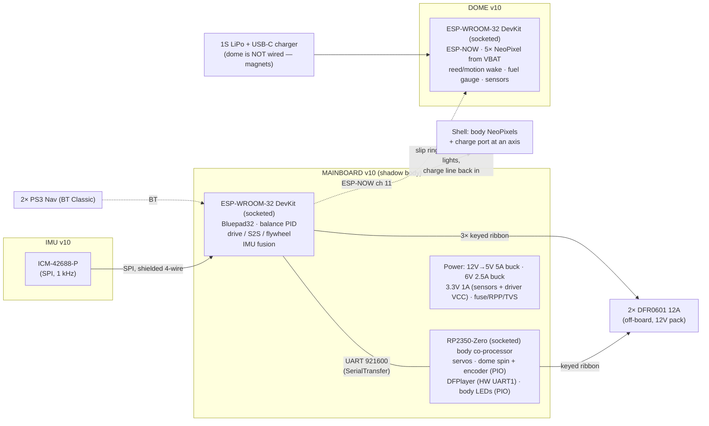
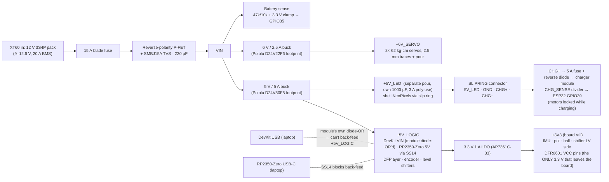

# Z-Class v10.0 — Board Redesign

**Scope:** Mainboard ("shadow body" v9.15 → v10.0), IMU board (v8.2 → v10.0), Dome board (v8.2 → v10.0)
**Inputs:** full netlist reconstruction of the v9.15 / v8.2 Gerbers (`PCB_ANALYSIS.md`), the RC4 firmware work, and two bench sessions
**Status:** design specification for schematic capture — not yet laid out

---

## 1. Why v10 — what the current boards actually do wrong

The v9.15 zips contain only Gerbers (no schematic), so every net below was reconstructed from copper. **Every firmware pin matches the PCB** — nothing in v9.15 is mis-wired. The problems are structural:

| # | v9.15 / v8.2 defect | Consequence seen on the bench |
|---|---|---|
| 1 | **All traces 6 mil, no ground pour, 4 vias on the whole board** — including GND, +5 V and the +6 V servo feed (~0.35 Ω) | 0.7 V drop at 2 A on the servo rail; brown-outs under servo + audio + BT bursts; one 1000 µF and zero 100 nF decoupling |
| 2 | **5 V injected into both Feathers' USB/VBUS pins** with no diode | A laptop on either USB port parallels its 5 V with the Pololu buck — exactly the condition during every tuning session |
| 3 | **DFPlayer on SoftwareSerial** (32u4 D9/A4) | Interrupts blocked ~1 ms/byte → the CRC/PAYLOAD errors on the 74880 link correlated with every sound command |
| 4 | **32u4 at 93 % flash / 1.7 KB of 2.5 KB RAM** (8 MHz AVR) | No room left for body features; torn 32-bit encoder reads; servo jitter from ISR load |
| 5 | **Separate MCU + UART just to read an I²C IMU** (Trinket M0) | 50→100 Hz serialised angle, extra firmware, extra board; 21 Hz DLPF was the original "laggy" feel |
| 6 | **Two 3.3 V LDOs (ESP32 Feather, 32u4 Feather) shorted through the DFR0601 VCC pins** | Two regulators fighting; ESP32 radio peaks starve the 32u4 |
| 7 | **ESP32 strapping pin IO12 used as UART TX to the 32u4; IO15 drives flywheel PWM; IO13 shares the red LED** | Boot depends on the 32u4 RX being high-Z; LED flickers with traffic |
| 8 | **200 kΩ S2S pot on IO34, no RC filter**, no pull-up (input-only pin) | Noisy position signal into the inner loop; a broken wiper floats the ADC |
| 9 | **"VCC sensor" JST straight into IO39** — the BOM module outputs 4.8 V at 24 V | Abs-max on the ESP32 ADC is 3.6 V |
| 10 | **BSS138 auto-direction shifter on NeoPixel data** | Too slow for 800 kHz WS2812 (Adafruit's own warning); flicker/garbage risk |
| 11 | **DFPlayer BUSY through a 20k/20k divider + INPUT_PULLUP** | ≈2.0 V against a 1.98 V VIH — on the threshold |
| 12 | **No input protection** — no fuse, reverse-polarity, TVS; unkeyed 0.1" motor ribbons (a reversed ribbon puts 3.3 V on GND) | |
| 13 | **Dome: "5V" jumpers actually select VBAT (3.7–4.2 V)**; no mounting holes; no series R / bulk cap on LED data; no I²C pull-ups | |
| 14 | **IMU: no mounting holes; two modules on 0.1" headers** | Mechanical resonance couples straight into the balance loop |
| 15 | **One 2.4 GHz radio shared by BT Classic (pads) and ESP-NOW (dome)** | Coexistence tuning was needed in RC4; unavoidable while both live on one ESP32 — but the dome link can be made far lighter |

Anything in this list that a bodge wire can fix on the *current* boards is in §9 (do those now).

---

## 2. Hard requirements that shape v10

1. **PS3 Navigation controllers → Bluetooth Classic → ESP32 (classic)**. ESP32-S3/C3 have no BT Classic. Bluepad32 stays. This single fact fixes the main MCU.
2. **Three physical boards stay** — the mechanics dictate it: the dome is magnetically mounted and unwired (battery + ESP-NOW), and the IMU sits on top of the frame at the pitch/roll axes, not wherever the mainboard fits.
3. **Motor drivers stay off-board** (DFR0601 12 A, 12 V pack). The mainboard is logic-only; motor current never touches it. Keep the 2×5 ribbon interface (now keyed).
4. **bb8 workflow unchanged**: USB flash + serial console per board, build stamps, banner on attach, `bb8 tune/pair` — v10 must keep a console UART and an auto-reset-on-open that *doesn't* wander into download mode.
5. **12 V 3S4P pack in** (§14), 5 V / 6 V / 3.3 V made on-board with real copper; 3.3 V never shared between modules.

---

## 3. System architecture v10



**What changed and why**

| v9.15 | v10 | Reason |
|---|---|---|
| HUZZAH32 Feather (socketed) | **ELEGOO ESP-WROOM-32 DevKit** (socketed, CP2102, standard auto-reset) | All 26 usable GPIO on the headers incl. 34/35/36/39 (Feather exposes 21); VIN/USB diode-OR'd on the module; same Bluepad32 core. |
| Feather 32u4 (8 MHz AVR, 28 KB) | **Waveshare RP2350-Zero** (socketed; 150 MHz, 2 MB flash, 520 KB RAM, 2 HW UARTs, 3 PIO blocks, 24 PWM, native USB) | Ends the flash ceiling; PIO does quadrature decode and WS2812 with zero CPU/ISR load; DFPlayer on a real UART kills the SoftwareSerial corruption. 23.5 × 18 mm. Arduino core: `earlephilhower/arduino-pico`. |
| Trinket M0 + MPU-6050 over UART | **ICM-42688-P** on a 20 × 20 mm daughterboard over **SPI** | Raw 1 kHz data into the ESP32; fusion (Mahony/complementary) on the control loop's own clock → no 50/100 Hz serialisation, no second firmware, ~2 ms latency. |
| Two Feather LDOs shorted via the driver ribbon | Each module regulates its own 3.3 V; **one board 3.3 V LDO** feeds sensors, shifters and **the DFR0601 VCC pins** | Ends the LDO fight; no module's 3V3 ever leaves the module |
| Off-board Pololu modules | **Buck modules on-board footprints** (Pololu D24V50F5 / D24V22F6) + protection | Real copper to the loads, one harness less |

**Why not one MCU?** The DevKit has 26 usable GPIO; the body functions need ~14 more than the balance side uses, and the encoder/WS2812/servo timing on the same core as a 100 Hz control loop + BT stack is asking for the jitter we just removed. The RP2350-Zero is $5 and makes the split clean. **Why not ESP32-S3 for the body?** No need for radio there; RP2350 PIO is the better peripheral set.

---

## 4. Mainboard v10.0 ("shadow body")

### 4.1 Power tree



Both modules make their own 3.3 V on-board (AMS1117 on the DevKit, ME6217 on the Zero) and those outputs are **left unconnected** — the v9.15 LDO-fight bug cannot recur.

- **Copper:** 2 oz outer layers; ground pour both sides with stitching vias every 10 mm; +5V_LOGIC / +5V_LED / +6V_SERVO as pours or ≥ 2.5 mm traces; 2-layer is fine at this density (4-layer optional for a cleaner ground).
- **Decoupling:** 100 nF at every IC/module pin pair + 10 µF per rail per region; 1000 µF on +5V_LED, 470 µF on +5V_LOGIC, 470 µF on +6V_SERVO, 100 µF on VIN after the TVS.
- **USB:** each USB-C can power its MCU for bench work; the ideal diodes mean a laptop never back-feeds the buck and the buck never back-feeds the laptop.
- **Enable / E-stop:** a 2-pin `ESTOP` JST (normally closed loop) read by the ESP32 and ANDed into a hardware `MOTOR_EN` line that holds all DFR0601 PWM inputs low through 10 k pull-downs when open or during reset.

### 4.2 ESP-WROOM-32 DevKit pin map — validated against the module's header

The ELEGOO board is the classic "ESP32 DevKit V1" layout (CP2102, EN + BOOT buttons, blue LED on GPIO2, AMS1117). It ships as **30-pin (2 × 15) or 38-pin (2 × 19)**; both expose every GPIO used below — the 38-pin adds only GPIO0 and extra GNDs. **Confirm the pin count on arrival; the socket footprint differs (30-pin rows are 25.4 mm apart, 38-pin 27.9 mm).** GPIO 6–11 (flash) are not on either header — correct, we don't use them.

Header order, 30-pin (USB at the bottom): left `EN VP(36) VN(39) 34 35 32 33 25 26 27 14 12 13 GND VIN` · right `3V3 GND 15 2 4 RX2(16) TX2(17) 5 18 19 21 RX0(3) TX0(1) 22 23`.

Strapping rules respected: BOOT button handles GPIO0 (not on the 30-pin header — fine); GPIO2 carries the module's blue LED (status, output only); **GPIO12 unused**; GPIO15 only as I²C SCL (pulled high = correct strap state); GPIO5 as SPI CS (idle high = correct). 34/35/36/39 are input-only (no internal pull-ups → external resistors).

| GPIO | Header label | Function | Notes |
|---|---|---|---|
| 1 / 3 | TX0 / RX0 | UART0 → CP2102 on the module | console + flashing; module's own DTR/RTS auto-reset, standard esptool polarity ✓ |
| 2 | D2 | status LED (module's blue LED) | |
| 4, 16, 17 | D4, RX2, TX2 | DRIVE: PWM, INA, INB | 20 kHz LEDC; 10 k pull-downs at the header. (UART2's default pins are repurposed as GPIO — UART2 is re-mapped to 21/22 via the GPIO matrix.) |
| 25, 26, 27 | D25, D26, D27 | S2S: PWM, INA, INB | |
| 32, 33, 14 | D32, D33, D14 | FLYWHEEL: PWM, INA, INB | |
| 18, 19, 23, 5 | D18, D19, D23, D5 | IMU SPI: SCK, MISO, MOSI, CS | VSPI defaults; to the IMU JST-SH 6-pin |
| 21 / 22 | D21 / D22 | UART2 TX/RX ↔ RP2350-Zero GP1/GP0 | 921600 baud, 3.3 V, short on-board trace; `Serial2.begin(921600, SERIAL_8N1, 22, 21)` |
| 13 / 15 | D13 / D15 | I²C SDA / SCL (4.7 k pull-ups) | expansion JST + optional AS5600 S2S encoder; SCL pull-up keeps GPIO15 high at boot ✓ |
| 34 | D34 | S2S pot wiper | 10 k pot, 1 k series + 100 nF to GND |
| 35 | D35 | battery sense | 47k/10k divider (12.6 V → 2.21 V), BAT54 clamp to 3V3 |
| 36 | VP | ESTOP loop sense | external 10 k pull-up |
| 39 | VN | CHG_SENSE (charger present) | divider from CHG+; firmware: charging → drive force-disabled |
| VIN | VIN | +5V_LOGIC in | module diode-OR's VIN with its USB ✓ |
| 3V3 | 3V3 | **not connected** | module's AMS1117 powers the module only |

Count: 21 GPIO used of 26 available. Spare on the header: none worth planning on (0 is BOOT, 12 is a strap) — expansion goes through I²C.

### 4.3 RP2350-Zero pin map — validated against the module's edge pins

The Waveshare RP2350-Zero exposes **20 GPIO on its edge**: GP0–GP15 down the two long sides and GP26–GP29 + 5V / GND / 3V3 on the short end (23 pads). **GP16–GP25 exist only as back-side reflow pads** — not used. GP16 also drives the module's on-board WS2812 status LED. Reset and BOOT buttons on the module.

| GP | Function | Peripheral check | Notes |
|---|---|---|---|
| 0 / 1 | UART0 TX / RX ↔ DevKit GPIO22 / 21 | UART0 default pins ✓ | 921600; `Serial1` in arduino-pico |
| 4 / 5 | UART1 TX / RX → DFPlayer RX / TX | UART1 default pins ✓ | hardware UART (`Serial2`); 1 k series on TX |
| 6, 7 | dome-tilt servos L / R | PWM slice 3A/3B ✓ | 50 Hz, µs resolution |
| 8, 9, 10 | dome spin PWM / INA / INB | PWM slice 4A + GPIO | to DFR0601 ch B via the keyed ribbon |
| 11, 12 | dome encoder A / B | **PIO quadrature** (any GPIO) ✓ | 5 V encoder → 74LVC245 (or BSS138 pair) |
| 13 | hall | GPIO in | 10 k external pull-up (E9: never rely on internal pulls) |
| 14 | body NeoPixel data | **PIO WS2812** ✓ | → 74AHCT125 → 330 Ω |
| 15 | DFPlayer BUSY | GPIO in | 3.3 V logic, direct |
| 26 / 27 | I²C1 SDA / SCL (4.7 k) | I²C1 default pins ✓ | expansion JST |
| 28 | +5V_LOGIC sense | ADC2 ✓ | 10k/10k divider |
| 2 | MAX9744 SHDN (amp mute) | GPIO out | low at boot = silent, no pop |
| 3, 29 | spare | 29 = ADC3 | |
| GP16 (internal) | on-board RGB status LED | PIO WS2812 | already wired on the module |
| 5V | +5V_LOGIC in via SS14 | | the Zero has no USB back-feed diode — the SS14 is it |
| 3V3 | **not connected** | | module's ME6217 powers the module only |
| USB-C | bb8 `upload body` | | UF2 / picotool via arduino-cli, VID `2E8A` |

Count: 17 GPIO used of 20 on the edge, 3 spare. Not 5 V tolerant — every 5 V signal (encoder, shell-side anything) is shifted. **RP2350 erratum E9:** internal pull-downs leak; every input has an external resistor (hall, encoder, BUSY are all actively driven or externally pulled).

### 4.4 Connectors (all keyed; JST-XH unless noted)

| Ref | Type | Pinout |
|---|---|---|
| `BAT_IN` | XT60 | + / − |
| `MOTOR_A`, `MOTOR_B` | 2×5 **shrouded boxed header** | per DFR0601: VCC(3V3) PWM1 INA1 INB1 GND / VCC PWM2 INA2 INB2 GND — A = DRIVE + S2S, B = FLYWHEEL + DOME |
| `SERVO_L`, `SERVO_R` | 3-pin JST-XH | SIG / +6V / GND |
| `IMU` | JST-SH 6-pin (1 mm) | 3V3 GND SCK MISO MOSI CS — shielded cable ≤ 15 cm |
| `S2S_POT` | 3-pin | 3V3 / WIPER / GND |
| `DOME_ENC` | 4-pin | 5V / GND / A / B |
| `HALL` | 3-pin | 3V3 / GND / SIG |
| `NEOPIX` | 3-pin | 5V_LED / GND / DATA |
| `SLIPRING` | 4-pin JST-VH (3.96 mm) | 5V_LED / GND / CHG+ / CHG− — 5 V out to the shell lights; charge input from the shell-mounted port back to the charger |
| `CHARGER` | 2-pin XT30 | CHG+ / CHG− pass-through (fused, reverse-blocked) to the pack charger module |
| `SPK_L`, `SPK_R` | 2-pin JST-VH each | MAX9744 bridge-tied outputs (never grounded) — see §17 |
| `ESTOP` | 2-pin | normally-closed loop |
| `I2C_EXP` ×2 | 4-pin (Qwiic-compatible JST-SH optional) | 3V3 / GND / SDA / SCL |
| `USB_ESP`, `USB_RP` | USB-C | |

### 4.5 Bench / test features

Test points on 3V3, 5V_LOGIC, 5V_LED, 6V, VIN, both UART links, MOTOR_EN. Silkscreen: every connector pinout printed next to it, board name/version, and the `bb8` target name (`drive`, `body`) next to each USB port.

---

## 5. IMU board v10.0

**Goal:** the smallest, stiffest thing that can be bolted at the frame pivot.

- **ICM-42688-P** (TDK) — 3-axis gyro/accel, SPI up to 24 MHz, internal 1 kHz ODR, on-chip low-pass; far lower noise than the MPU-6050. Alternative footprint: **BMI270**.
- **No MCU.** SPI straight to the ESP32 (fusion on the control loop). If the cable must be long (> 20 cm) or routed near motor leads, the fallback is a **BNO085 in UART-RVC mode** (fused pitch/roll at 100 Hz over 3 wires, immune to SPI cable issues) — leave that footprint as a DNP option on the same board.
- 20 × 20 mm, **4× M2.5 mounting holes**, 1.6 mm FR4, components on one side so it mounts flat against metal; orientation arrow and axis legend on silk.
- 3.3 V in, 100 nF + 1 µF decoupling, 33 Ω series on SCK/MOSI, JST-SH 6-pin.

Firmware: `TrinketM0_MPU_RC4` retires; the ESP32 gets a `Imu` module (ICM-42688 driver + Mahony filter at 1 kHz, angles sampled by the 100 Hz control tick). The existing `GYRO_*_SIGN` logic becomes a mounting-orientation matrix.

---

## 6. Dome board v10.0

- **ELEGOO ESP-WROOM-32 DevKit, socketed** (same module as the drive — one BOM line, one footprint; keeps the ESP-NOW firmware). Its own CP2102 + USB for bb8.
- **Power — the dome is not wired to anything** (it rides the shell on magnets), so it is a battery product:
  - **1S LiPo 2500–3000 mAh** on a JST-PH; **USB-C charging at 1 A** (BQ24075 or MCP73831 at 500 mA) with charge/done LEDs; **MAX17048 fuel gauge** on I²C so the drive can show dome battery % in telemetry (today's `A13` divider read becomes a real gauge).
  - **NeoPixels run straight from VBAT** (3.7–4.2 V): 3.3 V data ≥ 0.7 × VBAT, so no level shifter and no boost are needed — v8.2's "5V = VBAT" jumpers were accidentally right. 330 Ω series per data line, 1000 µF on the LED rail, 3.3 V LDO (AP2112K, low IQ) for the ESP32. Budget: ESP32 + 5 pixels ≈ 150–250 mA → 10+ h; deep sleep < 1 mA.
  - **Wake/sleep without a button:** a reed switch (GPIO39, ext0) closed by a magnet on the shell's dome-contact ring wakes it when placed; or a LIS3DH motion interrupt. Power switch optional.
- **LEDs:** 5 channels (PSI, sLogic, lLogic, HP, eye) through a **74AHCT125** (5 V data), 330 Ω series each, keyed 3-pin JSTs (5V / GND / DATA). HP moves off strapping GPIO15 → GPIO14; firmware pin table updated.
- **I²C** with 4.7 k pull-ups on GPIO21/22 to a Qwiic-style connector (ToF / PIR / gesture sensors the README promised); one spare GPIO (26) broken out for a PIR.
- **Wake button** on GPIO39 with external pull-up (ext0 wake, RTC-capable), replacing the current always-high GPIO35 wake.
- 4× M3 mounting holes, test points, silk pinouts.

---

## 7. Firmware impact (what changes in the repo)

| Board | Change |
|---|---|
| drive (ESP32) | pin table; IMU module (SPI + fusion) replaces `receiveFromTrinket`; link to body → UART2 at 921600; `MOTOR_EN` + ESTOP handling; battery telemetry from GPIO35 |
| body (RP2350-Zero, new sketch `RP2350_BODY_RC5`) | port of `32U4_DRIVE_RC4`: Servo → `Servo`/PWM; encoder → PIO quadrature; NeoPixel → PIO; DFPlayer → `Serial1`; EEPROM → LittleFS/`EEPROM` emulation; same serial command set + banner so bb8 and the runbook stay valid |
| imu | retired |
| dome | pin table (HP → 14), wake GPIO, sensor hooks |
| bb8 | `targets.json`: body → `rp2040:rp2040:waveshare_rp2350_zero`, VID `2E8A`; drive/dome → `esp32-bluepad32:esp32:esp32` (DevKit), VID `10C4`; upload via arduino-cli (picotool/UF2 for the Zero) |

The protocol between drive and body stays SerialTransfer with the same structs, so the transition can happen one board at a time.

---

## 8. BOM (major items, per set)

| Item | Part | ≈ $ |
|---|---|---|
| Main MCU | ELEGOO ESP-WROOM-32 DevKit ×2 (drive + dome, socketed) | 16 |
| Body MCU | Waveshare RP2350-Zero (socketed) | 5 |
| USB-UART | on the DevKits | — |
| IMU | ICM-42688-P | 4 |
| Bucks | Pololu D36V50F5 (5 V 5 A), D36V28F6 (6 V 2.7 A) | 20 + 12 |
| LDOs | AP7361C-33 ×2 | 1 |
| Level shift | 74AHCT125 ×2, 74LVC245 | 2 |
| Protection | fuse holder, SI2309 P-FET, SMBJ33A, LM66100 ×3 | 5 |
| Audio | DFPlayer Mini + MAX9744 amp + passives | 8 |
| Connectors | XT60, shrouded 2×5 ×2, JST-XH kit, JST-SH ×3, USB-C ×3 | 10 |
| Passives / caps | | 8 |
| PCBs (3 boards, 2 oz, 5 pcs) | JLC/PCBWay | 25 |

Roughly **$100 per droid set**, versus ~$85 of Feathers + Trinket today — and it deletes a whole board and two firmwares.

---

## 9. Do these NOW on v9.15 / v8.2 (bodges, 1 hour)

1. **Jumper the +6 V servo trace** with 18 AWG from `6V_IN` to both servo connectors; same for the GND return.
2. **Schottky diode (SS34) in series with each Feather's 5 V feed** (cut the trace to the USB pin, bridge with the diode) — stops laptop/buck back-feeding during tuning.
3. **100 nF** across DFPlayer VCC/GND, at each Feather 3V3/GND, at the BOB-12009.
4. **S2S pot → 10 kΩ**; add 100 nF from wiper to GND at the JST.
5. **Unplug / never use the `VCC Sensor` JST** until there's a divider (or fit 10 k/3.3 k + 3.3 V Zener inline).
6. **Encoder / hall 4.7 k pull-ups** at the connectors.
7. **Replace the NeoPixel BSS138 channel** with a 74AHCT125 breakout inline (or drive the first pixel from 3.3 V with a 5 V-tolerant strip).
8. Mark the motor ribbons pin-1 with paint; a reversed ribbon shorts 3.3 V to GND.

None of these change firmware.

---

## 10. Open questions before schematic capture

1. ~~Slip ring wiring~~ **Answered:** the slip ring carries **5 V for the shell (ball) lights**, and will carry the **charge line from a charging port at one of the shell's axis points**. Spec: 4-circuit `SLIPRING` (5V_LED, GND, CHG+, CHG−), polyfused LED out, fused + reverse-blocked charge pass-through to the pack charger, `CHG_SENSE` so firmware **locks the drive while the charger is plugged in**. The dome is magnetically mounted and **unwired → battery + USB-C charging** (§6). Still to confirm: slip-ring current rating vs charger current (a 2 A charger needs ≥ 2 A rings; paralleling two rings for CHG+ is the usual fix).
2. ~~IMU mounting spot~~ **Answered:** the IMU sits on **top of the frame at the front or back**, aligned to the pitch/roll axes; the frame itself is tilted by swinging the lower flywheel mass for S2S. Consequences: cable run from the mainboard ≈ 15–30 cm → **SPI at 1 MHz with 33 Ω series terminations over a shielded 6-wire cable is fine** (1 kHz × 14 bytes is trivial bandwidth); BNO085-RVC stays the DNP fallback only if the run exceeds ~40 cm. Because the sensor is **off the pitch axis**, frame rotation adds centripetal/tangential acceleration to the accel channels — fusion must be **gyro-dominant** (Mahony/complementary with a low accel weight, τ ≈ 1–2 s), and the mounting position must be entered as a lever-arm so the firmware can subtract it. Mount as close to the pitch axis as the frame allows; a 20 × 20 mm board with 4× M2.5 makes that easy.
3. **Pack voltage** — commit to 24 V (bucks are sized for it) or keep a 12 V option?
4. ~~S2S position sensing~~ **Proposed: AS5600 on the tilt pivot** (§16) with the pot kept as a wiring-compatible fallback. Confirm the pivot end has clearance for a 6 mm magnet cap + the breakout.
5. ~~Audio~~ **Decided: on-board MAX9744 I²C class-D amp fed by the DFPlayer** (§17); external amp, isolator and 9 V feed deleted.
6. Board outline / mounting pattern — same 116 × 63 mm with the 4 holes at the current coordinates, or free to change?

---

## 11. Delivery plan

| Phase | Deliverable |
|---|---|
| 0 | §9 bodges on the current boards (unblocks field testing now) |
| 1 | KiCad schematics for all three boards from this spec; design review against the v9.15 netlist |
| 2 | Layout (2 oz), DRC, 5-piece prototype order |
| 3 | `RP2350_BODY_RC5` firmware port + ESP32 IMU module, bench-tested on dev boards before PCBs arrive |
| 4 | Bring-up with bb8 (stamps, banners, tune, pair unchanged), then one-board-at-a-time swap into the droid |

---

## 12. Module options (if you'd rather socket boards than solder bare modules)

Filter #1: the pads need Bluetooth Classic → the main MCU must be a **classic ESP32** (S3/C3/C6 have none).
Filter #2: the body side wants hardware UARTs + timing peripherals, not a faster AVR.

| Role | Module | Pins / serial | Verdict |
|---|---|---|---|
| **Main (drive)** | **DFRobot FireBeetle 2 ESP32-E** (DFR0654) | WROOM-32E; exposes essentially all 24 usable GPIO incl. 35/36/39; USB-C; LiPo charger; castellated *and* through-hole | **Best socketed choice.** Same chip as the bare-module design in §4, so the pin map there applies 1:1. Drop-in for the HUZZAH32's job with 3–4 more GPIO. |
| Main (drive) | Adafruit ESP32 Feather V2 | ESP32-PICO-MINI; Feather pinout (~21 GPIO); STEMMA QT | Feather-compatible but no pin gain over today — only worth it to keep the Feather socket. |
| Main (drive) | bare ESP32-WROOM-32E | all GPIO | Cheapest, smallest; needs SMD assembly (JLC does it for ~$8/board). |
| **Body (co-processor)** | **Raspberry Pi Pico 2 (RP2350)** | 26 GPIO, **2 HW UART**, 3 PIO blocks (12 state machines), 24 PWM, native USB, 520 KB RAM, 4 MB flash, $5 | **Best socketed choice.** Quadrature, WS2812 and servo timing in PIO; DFPlayer on a real UART. Through-hole/castellated, Arduino core mature (`arduino-pico`). Pico (RP2040) is fine too; Pico 2 is the same price with headroom. |
| Body | Adafruit Feather RP2040 | RP2040 in the **Feather footprint** | Physically replaces the Feather 32u4 in today's socket — a possible "v9.16" stopgap. But the 32u4 PCB routes the DFPlayer to A4/D9; check that those land on RP2040 pins that can host UART1 (or accept a PIO UART). Not a free lunch. |
| Body | Teensy 4.0 | 40 pins, **7 hardware UARTs**, 600 MHz, $24 | The raw "serial and pins" champion if UART count ever becomes the limiter (e.g. several serial sound/LED boards). Overkill for today's body; 3.3 V only. |
| **Dome** | FireBeetle 2 ESP32-E | as above | Same module as the main board = one BOM line, same auto-reset circuit, code unchanged. |
| Dome | FireBeetle ESP32-C3 / XIAO ESP32-C3 | small, cheap, ESP-NOW works | Only if size matters; ESP-NOW code ports but the sketch's GPIO table changes. |
| IMU | ICM-42688-P breakout (SparkFun/Adafruit) | SPI/I²C | Mount on the 20×20 carrier from §5 until the custom board exists. |

**Recommended socketed set:** FireBeetle 2 ESP32-E (drive) + Pico 2 (body) + FireBeetle 2 ESP32-E (dome) + ICM-42688 breakout. It preserves "boards in sockets" maintainability, gains the pins and UARTs, and the §4 pin maps carry over unchanged except the RP2040 pins become Pico GP numbers.

What *not* to chase: more ESP32 UARTs. The classic ESP32 has exactly 3 (UART0 console, UART1, UART2, all pin-remappable) — v10 only needs two (console + body link) once the IMU moves to SPI.

---

## 13. Chosen modules & 12 V power (decisions 2026-08-21)

**Pack: 12 V / 12 A.** Socketed modules: **Waveshare RP2350-Zero** (body) and **ELEGOO ESP-WROOM-32 38-pin DevKit** (drive and dome). Board kept as small as possible; copper and ground done properly.

### 13.1 RP2350-Zero body pin map

See §4.3 (validated against the module edge pins).

### 13.2 ESP-WROOM-32 DevKit for drive and dome (pin map in §4.2)

- All GPIO of the §4 / §6 pin maps are on the headers (incl. 34/35/36/39).
- Standard esptool auto-reset polarity (EN ← RTS, IO0 ← DTR) — bb8's port-open reset behaves.
- **VIN and USB are diode-OR'd on the module** → feed VIN with +5V_LOGIC; a laptop on the USB can't back-feed the rail. The module's AMS1117 powers only the module.
- Footprint: 2 × 19-pin 0.1" rows, 25.4 mm apart, 52 × 28 mm. Socket with machined-pin female headers; keep the antenna end overhanging the board edge, no copper under it.

### 13.3 Power at 12 V

| Stage | Part | Notes |
|---|---|---|
| Input | XT60, **15 A blade fuse**, P-FET reverse polarity, **SMBJ15A** TVS, 220 µF | |
| 5 V | **Pololu D24V50F5** (5 A) | +5V_LOGIC (modules, DFPlayer, shifters) and +5V_LED (shell lights via slip ring, own polyfuse + 1000 µF) |
| 6 V | **Pololu D24V22F6** (2.5 A) — or D36V28F6 | servos only; 2.5 mm traces + pour |
| 3.3 V | AP7361C-33 (1 A) | IMU, pot, hall, level-shifter LV side, **motor-driver VCC pins** (one rail, never a module's 3V3) |
| Sense | 47k / 10k divider + 3.3 V clamp → GPIO35 | 12.6 V → 2.2 V |
| Charge path | `SLIPRING` CHG± → 5 A fuse + SS54 → charger module; CHG_SENSE → GPIO39 | drive locked while charging |

Size target: ~85 × 60 mm, 2-layer 2 oz. Biggest single space saver if needed later: bare WROOM-32E instead of the DevKit (−15 cm² each).

---

## 14. Battery — DCZ12-12A, 12 V 12 Ah Li-ion 3S4P (eBay 800431024412)

| Spec (listing) | Value | Design consequence |
|---|---|---|
| Chemistry / config | Li-ion **3S4P**, 9–12.6 V, 144 Wh, > 1000 cycles | Charger = 12.6 V CC/CV 3S. Sense divider 47k/10k → 2.21 V at 12.6 V. |
| **BMS** | **20 A max** (label: 15 A output) | **The constraint** — see 14.2. |
| Charger | 12.6 V **1 A** (9 h) | Slip-ring charge path ≤ 1 A is trivial; a 12.6 V 2–3 A charger halves the time on the same BMS. |
| Size / weight | 80 × 66 × 60 mm, 540 g | Fits the flywheel carriage flat and centred. |
| Output | bare wires | Crimp **XT60**; **20 A ATO fuse holder** on the + lead at the pack (board fuse 15 A stays below it). |
| Runtime (est.) | 6–8 h idle balancing · **2–3 h active driving** (4–6 A avg) | |

**Firmware:** warn at 10.2 V (3.4 V/cell), **force-disable drive at 9.6 V** (3.2 V/cell) — before the BMS cuts power abruptly mid-balance. `pref lowbat 9.6`.

### 14.1 If the pack ever changes — what the chemistry decides

| If it is… | Full / empty | Consequence for v10 |
|---|---|---|
| **Li-ion 3S** (this pack) | 12.6 / 9.0 V | Charger 12.6 V 3S; cutoff 9.6 V. |
| **LiFePO4 4S** (12.8 V nom.) | 14.6 / 10.0 V | Charger 14.6 V LiFePO4 type; sense 2.56 V at full; cutoff ≈ 11.0 V. |
| **SLA / AGM** | 13.8 / 10.5 V | 13.8 V float charger; no BMS. |

### 14.2 The 20 A BMS is the one number to respect

At 12 V the motors stall at ≈ 9 A (drive, flywheel — ServoCity 5202/5203 class), ≈ 11.5 A (NeveRest dome), ≈ 3–5 A (S2S worm), plus ≈ 3 A of servo + logic draw reflected to 12 V. A **flywheel spin-up during a drive reversal can exceed 20 A → the BMS opens instantly → the balance loop loses power → the droid falls.** That is the failure mode of this pack in this robot, so it gets designed out twice:

1. **Firmware power governor** (valid for the current droid too — same motors): estimated draw = Σ (PWM fraction × stall current) per channel; above ≈ 14 A scale the **flywheel first, then dome spin**, never the balance channels; flywheel spin-up gets its own slew limit. Telemetry field `amps` (estimated) and a `[POWER] governed` event.
2. **Second identical pack in parallel** when space allows: 40 A of BMS headroom, 24 Ah, 1.08 kg on the pendulum (more steering authority too). Join only at equal voltage (both full).

Other checks: charge current 1–3 A → a single slip-ring circuit is fine; CHG+ → 3 A fuse → **directly to pack +** (common-port BMS — no series diode, or the 12.6 V CV phase ends 0.4 V short); reverse protection by the keyed barrel/XT30 at the shell, or an LM74610 ideal-diode controller (≈ 0 V drop).

### 14.3 Placement in the flywheel carriage — it changes the physics, mostly for the better

The flywheel area is the pendulum mass the S2S swings left/right to steer.
- **Lower CG, more mass displaced per degree** → more steering authority and inherently steadier pitch. Good.
- **More inertia on the S2S axis** → the worm-gear actuator's bandwidth drops further. The 2026-08-20 capture already showed the S2S lagging its target by 180 ms at Kp = 30; expect final outer gains around Kp 6–10 with `pref swing` ≤ 40. Re-run `bb8 tune s2s` after the install — the tuner will find it.
- **Centre it left-right** on the carriage; an off-centre pack bakes a roll bias into the zero that calibration then hides (and costs S2S authority on one side).
- Secure against the swing (it's accelerated every steering move): strap + blocks, cable with strain relief, fuse **at the pack** (ATO holder on the + lead) in addition to the board fuse.

---

## 15. Repository branches

`main` = v9.15 / v8.2 hardware (RC4.x firmware, kept supported). **`v10`** = this design: new firmware ports (`RP2350_BODY_RC5`, drive IMU module, pin tables), `targets.json` for the DevKit / RP2350-Zero, KiCad sources under `hardware/`. bb8 and the docs are shared — fix on `main`, merge into `v10`.

---

## 16. S2S position sensor — AS5600 on the tilt pivot (replaces the pot)

**Where:** on the **S2S tilt pivot** — the axle about which the frame tips left/right relative to the drive carriage — i.e. the pot's current location. That is the only place the angle is measured 1:1, absolute, with no gearing or backlash between sensor and frame. Either end of the pivot; pick the one with clearance nearest the mainboard.

```
        frame (tilts L/R)                     carriage (fixed)
    ════════════╗                         ╔══════════════
                ║   pivot bolt / axle     ║
                ║ ───────────────────────►║   ┌──────────────┐
                ║                  [N|S]  ║   │ AS5600 board │  bracket to the
                ║          magnet in a    ║   │   chip  ●    │  carriage, coaxial
                ║          plastic cap on ║   └──────────────┘
                ║          the axle end   ║     ◄─ 1–2 mm ─►  air gap
    ════════════╝                         ╚══════════════
```

**Mechanical rules**
- Diametrically magnetised **6 × 2.5 mm** magnet, **centred on the rotation axis ±0.25 mm**, air gap **0.5–3 mm**, chip centred over it.
- Magnet carried in a **3D-printed or brass cap** pressed onto the axle end so steel bolt heads / bearings stay ≥ 3–5 mm away (steel *behind* the magnet is tolerated; steel *beside* it is not).
- Sensor board on the **non-rotating** side, 2 × M2 on a printed bracket — the cable never flexes with the tilt.

**Electrical — drop-in for the pot**
- Wire **both** outputs. `OUT` (ratiometric analog 0–VDD) → the existing pot input **GPIO34** through the same 1 k / 100 nF filter: the 100 Hz loop keeps reading an "ADC pot", no I²C in the control path. Programmed once (via I²C, `ZPOS`/`MPOS`) so the 92° swing spans 0–3.3 V → ≈ **4000 counts over the swing** (pot today ≈ 1000), zero wear, zero wiper noise.
- **I²C** (GPIO13/15, address 0x36) only for that programming and for health: magnet `DETECTED / TOO WEAK / TOO STRONG` status → `[S2S] sensor OK` in `cfg show`, and a safety cutoff if the magnet is lost (a pot cannot report that).
- `DIR` pin strapped so counts increase toward right tilt (else `REVERSE_S2S`). 3.3 V supply. Connector: JST-XH 5-pin (3V3 · GND · OUT · SDA · SCL) replacing `S2S_POT`; the pot stays usable on the same OUT pin as a fallback.

**Firmware:** no change in the control loop; `cfg calibrate s2s` still finds centre; `pref innerkp` rescales for the 4× counts (≈ 0.9 → 0.25 PWM/count) — or the firmware normalises counts to degrees and the gain stays in PWM/deg.

---

## 17. On-board audio — DFPlayer source + MAX9744 I²C class-D amp

Decision: bring the amplifier onto the mainboard; drop the external amp, its 12 V feed, the 3.5 mm cable and the ground-loop isolator from the BOM.

```
DFPlayer Mini (SD card, MP3)  ──DAC_L/R──►  MAX9744  ──BTL──►  SPK_L / SPK_R (transducers, 4–8 Ω)
   UART1 from RP2350-Zero                   ▲  I²C1 (0x4B) volume 0–63, SHDN on GP2
                                            └── 12 V from VIN (own 3 A fuse, ferrite, 1000 µF)
```

| Item | Choice | Why |
|---|---|---|
| Amp | **MAX9744** (QFN-44 7 × 7 mm) | 2 × 20 W into 4–8 Ω from 4.5–14 V → runs on the 12 V pack directly, **volume over I²C** (63 steps), filterless class-D, shutdown pin. ≈ $3 + a dozen passives. |
| Source | DFPlayer Mini, unchanged | SD-card MP3s, `audio scan` diagnostics, seq-numbered sound protocol — nothing to rewrite |
| Why not I²S + MAX98357A | 3 W mono; decoding MP3 on the RP2350 is a firmware project | Not worth it for a droid that wants to be heard |
| Why not PAM8403 | 3 W, no volume control | Too small for transducers |

**Wiring**
- DFPlayer `DAC_L` / `DAC_R` → 1 µF → MAX9744 `INL+` / `INR+`; `INL−` / `INR−` → DFPlayer GND at a single star point (this is what the isolator was papering over).
- Outputs are **bridge-tied**: `SPK_L±`, `SPK_R±` on two 2-pin JST-VH, never grounded. Keep the BTL traces ≥ 1 mm, short, away from the IMU cable and the pot/AS5600 input.
- `SHDN` ← RP2350 **GP2**: held low at boot (no pop), released 200 ms after the DFPlayer initialises; firmware mutes on `silent` mode and on fault.
- `VDD` from **VIN** (not the 5 V rail — keep amp current off the logic buck): 3 A fuse, ferrite bead, 1000 µF + 10 µF + 100 nF at the pins. Ground pour under the QFN thermal pad with a via array (the 2 oz pour is the heatsink).
- I²C1 shared with the expansion header (GP26/27); address 0x4B fixed.

**Firmware** (`RP2350_BODY_RC5`): keep the DFPlayer at a fixed high level (≈ 25/30) for best SNR and map `vol <0-30>` / the pad's volume buttons onto the MAX9744 (0–63) over I²C; `audio status` reports amp present/ muted. `silentMode` → SHDN.

**Connector changes (§4.4):** `AUDIO_OUT` and `AUDIO_AUX` are replaced by `SPK_L` and `SPK_R` (2-pin JST-VH each). A line-level test point pair stays for scoping.
